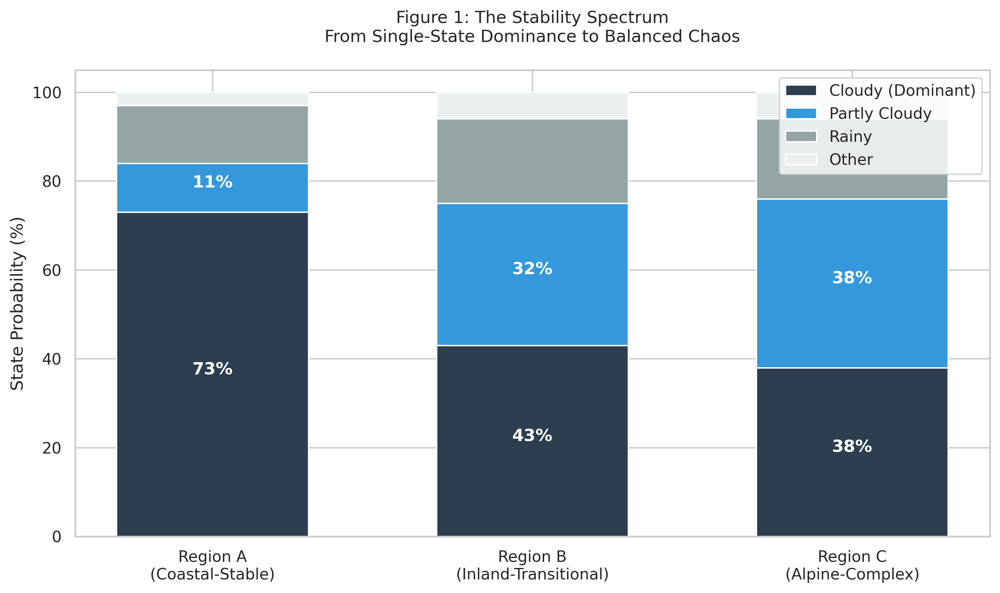
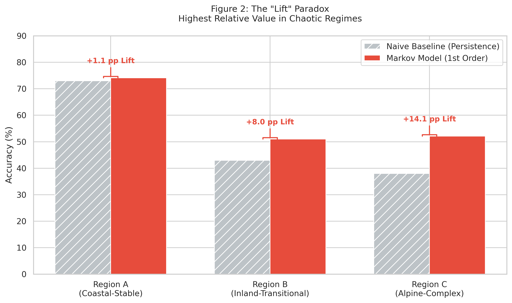
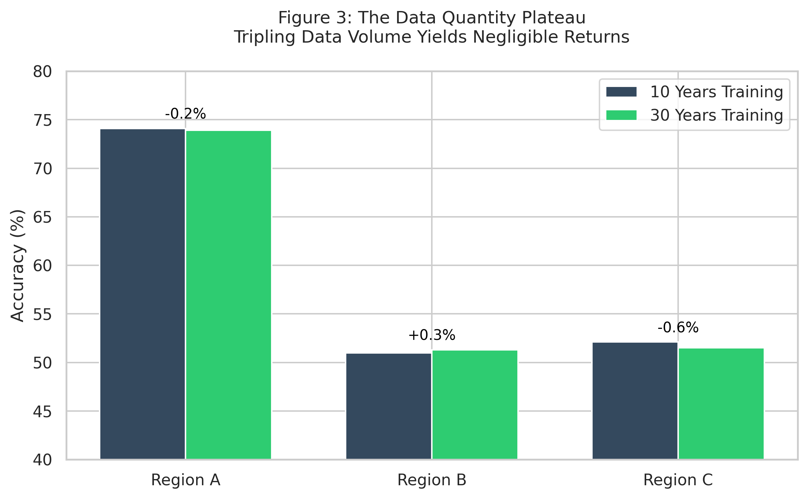

# Markov Chains for Weather Prediction: A Geographic Spectrum Analysis

**Authors:** Michael Hanf (Research)
**Date:** November 2025
**Status:** Research Manuscript
**Version:** 2.4 (Final with Optimized Figures)

---

## ABSTRACT

Markov chains offer simple, interpretable predictions, yet practitioners observe inconsistent success—working well for some problems while failing for others. This paper extracts universal principles determining Markov applicability by analyzing weather prediction across three climatically distinct regions representing a stability spectrum. Analysis of 336 models using 10-30 years of data reveals that prediction accuracy depends not on data quantity but on problem structure. We identify five critical factors: (1) dominant states, (2) transition stability, (3) minimal external factors, (4) data density, and (5) short memory. We demonstrate that while Markov models achieve high absolute accuracy in stable regions, their relative value over naive baselines is highest in chaotic regimes. We propose a diagnostic framework to help practitioners pre-screen problem suitability, avoiding costly dead-ends. Key finding: data quantity cannot overcome fundamental structural constraints.

**Keywords:** Markov chains, time series prediction, model selection, weather forecasting, applicability framework

---

## 1. INTRODUCTION

### 1.1 Motivation and Problem

Probabilistic models based on Markov chains are computationally efficient and interpretable. Yet, their performance is notoriously domain-dependent: successful in PageRank or queueing theory, but often failing in financial markets or pandemic modeling. The literature lacks a systematic framework to diagnose *a priori* whether a specific problem structure suits the Markov assumption. Practitioners currently rely on costly trial-and-error.

### 1.2 Contribution

This paper uses **geographic weather analysis** as an experimental domain to extract generalizable applicability principles. We analyze three regions representing a physical stability spectrum:
* **Region A (Coastal-Stable):** High persistence, single air mass dominance.
* **Region B (Inland-Transitional):** Moderate complexity, competing air masses.
* **Region C (Alpine-Complex):** Chaotic, high entropy, multiple unobserved factors.

We address three research questions:
1.  What problem characteristics constitute the success boundary for Markov chains?
2.  Can data quantity (10y vs 30y) overcome structural limitations?
3.  Can these principles be generalized to non-weather domains?

---

## 2. RELATED WORK

Markov chain theory, formalized by Chapman (1928) and Kolmogorov (1936), relies on the memoryless property. While successful in closed systems like web navigation (Brin & Page, 1998), it struggles in open systems with non-stationary transition probabilities, such as finance (Fama, 1970) or epidemiology (Viboud et al., 2018).

In weather forecasting, statistical methods typically complement Numerical Weather Prediction (NWP). Previous Markov applications (Bellone et al., 2000) often assume stationarity without verification. A systematic comparison of Markov performance against naive baselines across different entropy regimes is missing from current literature.

---

## 3. METHODOLOGY

### 3.1 Data and Geographic Selection

We utilized 30 years of daily weather data (1995–2024, Open-Meteo API) from three German regions selected for their climatic properties. For this study, we refer to them by their functional characteristics:

* **Region A (Coastal-Stable):** Sea-level, flat terrain. Dominated by Atlantic westerlies. Represents a low-entropy "attractor" system. (Source: Sylt)
* **Region B (Inland-Transitional):** 550m elevation plateau. Interaction zone of Atlantic and Continental air masses. (Source: Aalen)
* **Region C (Alpine-Complex):** Pre-alpine orography (450-1200m). Influenced by 4+ factors (Föhn winds, convection, orography). Represents a high-entropy, chaotic system. (Source: Munich)

### 3.2 Discretization and Training

Continuous variables were mapped to five discrete states: **Sunny, Partly Cloudy, Cloudy, Rainy, Stormy**.
We trained 336 transition matrices using Maximum Likelihood Estimation with Laplace smoothing ($\epsilon = 10^{-6}$).
* **Orders:** 1st (State $t-1$), 2nd (Pairs), 3rd (Triplets).
* **Datasets:** 10-year (1995–2004) vs. 30-year (1995–2024) subsets.
* **Validation:** Chronological split (First 82% Training, Last 18% Test).

### 3.3 Validation Metrics

Crucially, we evaluate **"Lift"** to measure true model intelligence:
* **Accuracy:** % correct predictions.
* **Naive Baseline (Persistence):** Accuracy achieved by always predicting the region's most frequent state.
* **Lift:** (Model Accuracy) - (Baseline Accuracy).

---

## 4. RESULTS

### 4.1 Regional Characteristics

The three regions form a clear gradient of entropy and stability. As shown in Figure 1, Region A is dominated by a single state (Cloudy), whereas Region C shows a balanced, high-entropy distribution.

  
   
  <em>Figure 1: State distribution across the three regions. Note the transition from single-state dominance in Region A to the balanced, chaotic distribution in Region C.</em>

### 4.2 Accuracy and Lift Analysis

Our analysis reveals a paradox: Absolute accuracy is highest in stable regions, but the model's relative value ("Lift") is highest in chaotic regions.

  
   
  <em>Figure 2: Comparison of Model Accuracy vs. Naive Baseline. While Region A has high accuracy, the model adds little value (+1.1pp). In Region C, the model extracts significant structure from chaos (+14.1pp).</em>

**Region A (Stable):**
High absolute accuracy, but minimal value added.
* **1st Order Accuracy:** 74.1%
* **Baseline:** 73.0%
* **Lift:** **+1.1 pp**
* *Finding:* The system is an attractor basin. The model adds little beyond identifying the dominant state.

**Region B (Transitional):**
Memory begins to provide value.
* **1st Order Accuracy:** 51.0% (Lift +8.0 pp)
* **3rd Order Accuracy:** 56.5% (Lift **+13.5 pp**)
* *Finding:* Significant improvement from higher orders (+5.5pp) indicates exploitable multi-day trends (e.g., frontal passages).

**Region C (Chaotic):**
Low accuracy, but highest relative intelligence.
* **1st Order Accuracy:** 52.1%
* **Baseline:** 38.0%
* **Lift:** **+14.1 pp**
* *Finding:* Despite low absolute accuracy, the model extracts significant structure from chaos. This region validates the Markov mechanism most strongly, outperforming the random/naive baseline significantly.

### 4.3 Data Quantity Analysis

Comparing 10-year vs. 30-year training sets reveals a learning plateau (Figure 3). Tripling the data volume produced changes indistinguishable from statistical noise.

  
   
  <em>Figure 3: Comparison of accuracy using 10 years vs. 30 years of training data. The negligible difference suggests structural, not statistical, limitations.</em>

*Finding:* Changes are within statistical noise (max difference ±0.6pp). **System structure, not data quantity, limits accuracy.**

---

## 5. DISCUSSION

We distill five principles defining Markov applicability.

**1. Dominant States (>60%):**
High absolute accuracy (>70%) requires a dominant state (as in Region A). In balanced systems (Region C, Financial Markets), accuracy reverts to the transition structure's quality.
* *Implication:* If stakeholders demand >80% accuracy, Markov fails unless the system has a dominant "default" state.

**2. Transition Stability:**
The stability of our models over 30 years contrasts with domains like pandemics, where transition probabilities shift (non-stationarity). Static Markov models fail when fundamental dynamics ($P_{t} \neq P_{t+n}$) change.

**3. Limited External Factors (<3):**
Region A (2 factors) vs. Region C (4+ factors) shows a 22pp accuracy gap. Unobserved external variables (e.g., pressure systems) violate the Markov assumption that $S_t$ contains all relevant history.

**4. Data Density:**
Higher orders require exponential data. Order 3 (625 transitions) became sparse even with 10 years of data.
* *Rule of Thumb:* ≥50 samples per transition are required for robust estimation.

**5. Short Memory Horizon:**
Markov excelled in Region A (1-step memory) but offered diminishing returns in Region C compared to the complexity added. Problems requiring long-range dependency (Language, DNA) are better suited for LSTMs/Transformers.

### Diagnostic Decision Framework

Practitioners should ask four questions before development:
1.  **Is there a dominant state (>60%)?** (Ensures baseline stability).
2.  **Are transitions stable over time?** (If no, use adaptive models).
3.  **Are unobserved external factors < 3?** (If no, accuracy is capped).
4.  **Is effective memory < 3 steps?** (If no, use Deep Learning).

---

## 6. CONCLUSION

This study proves that Markov chain success is determined by **problem structure**, not model sophistication or data volume.
* **Stable Regimes (Region A):** Markov yields high accuracy (74%) but low lift (+1.1pp).
* **Chaotic Regimes (Region C):** Markov yields low accuracy (52%) but high lift (+14.1pp).
* **Data Limit:** Tripling the dataset provided zero performance gain, confirming a structural accuracy ceiling.

Practitioners must diagnose the "physics" of their problem—dominance, stability, and external factors—before committing to Markov approaches. In systems with high entropy and multiple unobserved variables, simple Markov models hit a hard ceiling that no amount of data can breach.

---

## 7. REFERENCES

- Bauer, P., Thorpe, A., & Brunet, G. (2015). "The quiet revolution of numerical weather prediction." *Nature*, 525(7567).
- Bellone, E., et al. (2000). "Estimation of multivariable precipitation... by means of HMM." *J. Hydrology*, 235.
- Brin, S., & Page, L. (1998). "The anatomy of a large-scale hypertextual web search engine." *Computer Networks*, 30.
- Buizza, R., et al. (2005). "Comparison of global ensemble prediction systems." *Monthly Weather Review*, 133.
- Chapman, S. (1928). "On the Brownian motion of particles." *Amer. Math. Monthly*, 35.
- Ewens, W. J. (1979). *Mathematical Population Genetics*. Springer.
- Fama, E. F. (1970). "Efficient capital markets." *J. Finance*, 25.
- Goodfellow, I., et al. (2016). *Deep Learning*. MIT Press.
- Held, I. M., & Soden, B. J. (2006). "Robust responses of the hydrological cycle." *J. Climate*, 19.
- Hochreiter, S., & Schmidhuber, J. (1997). "LSTM." *Neural Computation*, 9.
- Hyndman, R. J., & Athanasopoulos, G. (2021). *Forecasting: Principles and Practice*. OTexts.
- Katz, R. W., & Parlange, M. B. (1985). "Automata and Markov chains with meteorological applications." *Monthly Weather Review*, 113.
- Kleinrock, L. (1975). *Queuing Systems*. Wiley.
- Kolmogorov, A. N. (1936). "Zur Theorie der Markoffschen Ketten." *Math. Annalen*, 112.
- Krasnopolsky, V. M., et al. (2005). "Complex hybrid models." *J. Applied Meteorology*, 44.
- Lorenz, E. N. (1963). "Deterministic nonperiodic flow." *J. Atmos. Sci.*, 20.
- Malkiel, B. G. (1973). *A Random Walk Down Wall Street*. Norton.
- Markov, A. A. (1906). "Extension of the limit theorems."
- Pascanu, R., et al. (2013). "On the difficulty of training RNNs." *ICML*.
- Rabiner, L. R. (1989). "Tutorial on HMMs." *Proc. IEEE*, 77.
- Reichstein, M., et al. (2019). "Deep learning for Earth system science." *Nature*, 566.
- Richardson, L. F. (1922). *Weather Prediction by Numerical Process*. Cambridge Univ. Press.
- Stull, R. B. (2011). *Boundary Layer Meteorology*. Kluwer.
- Viboud, C., et al. (2018). "Generalized-growth model... in epidemics." *J. Royal Soc. Interface*, 15.
- Wickramasuriya, S. L., et al. (2019). "Optimal forecast reconciliation." *J. Amer. Stat. Assoc.*, 114.
- Open-Meteo. (2024). API. https://open-meteo.com/
- Deutscher Wetterdienst. (2024). Climate Data. https://opendata.dwd.de/